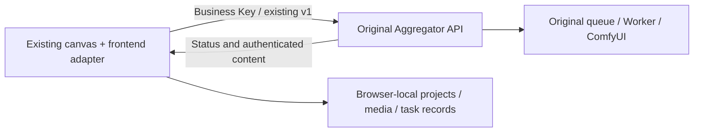

# ComfyUI Creative Canvas

[中文](README.md) · [Usage and deployment](docs/studio/21-独立画布部署与使用.md) · [Current scope and limits](docs/studio/37-交付范围纠正与核心适配现状.md) · [Documentation](docs/studio/README.md) · [Release notes](docs/studio/23-独立画布更新记录.md)

An independent Web canvas adapted from [basketikun/infinite-canvas](https://github.com/basketikun/infinite-canvas). It reuses the existing pan/zoom, nodes, connections and projects, and connects them to the existing ComfyUI Aggregator models, reference inputs, asynchronous jobs and artifacts. The browser calls that API directly; no new generation backend, queue or GPU proxy is required.

Static application **153.1** is deployed. This update corrects scope and documentation; application source and deployment stay at that version. The historical 46-row assessment includes implemented features, extended tests and external responsibilities; **it is not a list of 46 unimplemented features**. Core integration is implemented. The recent multi-reference video failure and unverified browsers remain explicit limitations rather than a claim that every published model currently succeeds.

| Canvas | Existing business API | Management |
| --- | --- | --- |
| [Open canvas](http://43.165.167.179:39445/studio/) | `http://43.165.167.179:39443` | [Existing Admin](http://43.165.167.179:39443/admin/) |

## Design and capabilities


```mermaid
flowchart LR
    W[Existing canvas + frontend adapter] -->|Business Key / existing v1| A[Original Aggregator API]
    A --> G[Original queue / Worker / ComfyUI]
    A -->|Status and authenticated content| W
    W --> L[Browser-local projects / media / task records]
```

| Capability | Behavior |
| --- | --- |
| Discovery | Read the Key-filtered descriptions, Schema, complete presets and reference slots; never infer parameters from a model name |
| Images and references | Adapt text-to-image, image editing and multiple-reference workflows; selected canvas images can populate published slots |
| Video | Use the separately published text, first-frame and multiple-reference workflows; do not silently discard required references |
| Audio and 3D | Audio is a ComfyUI Workflow output; GLB has a result card, on-demand preview and original download. Workflow audio is not assumed to be TTS |
| Asynchronous jobs | Upload → explicit submission → query the original job → load/save artifacts; restore existing records instead of blindly creating replacement jobs |
| Projects and media | Reuse canvas editing and projects; retain local persistence, project ZIP/task exports and existing reference protections |
| Lime themes and examples | Reuse the downloaded 04·Lime style, persist light/dark preference and offer eight editable examples with no generation before confirmation |

Business requests use a Bearer Key and `credentials: omit`, without an Admin session. Only the existing `/v1/` API is called. Forwarding, scheduling, Workers, databases and Admin remain unchanged. Management stays in the original Admin. Optional assistants, cloud sync, new formats and fleet capacity work do not automatically become canvas tasks.

## How to use

1. Open [Connection](http://43.165.167.179:39445/studio/config). Enter the **original API origin** and a **business API Key** supplied by its administrator. Do not enter the canvas port, Admin path or ComfyUI 8188. The Key stays in page memory by default; remembering it in a trusted browser is optional.
2. Read [Models and usage](http://43.165.167.179:39445/studio/models), then choose a permitted model and complete preset. Dimensions and duration must follow the published preset. Catalog visibility does not establish an idle device or sufficient quota.
3. Create/open a canvas, or open an editable project from [Examples](http://43.165.167.179:39445/studio/library). Examples can be viewed without a Key and do not upload or submit merely by opening.
4. Select images and choose “新建创作”. Review the prompt, model, complete preset and reference order/roles, then explicitly click “提交1项生成任务”. Other media follow their Schema; do not force a prompt onto the current image-to-3D model.
5. Query the original task from its node or task page. Continue editing or restore the record later. Cancellation needs server confirmation. On success, click “载入产物” to fetch and verify authenticated content, then play, reuse or save the original.
6. Save the project and export important originals or a project ZIP containing its files. Task JSON helps reconcile original jobs; it does not replace an artwork backup. Business permissions are configured in the original Admin.

Cloud artifacts normally expire **eight hours after completion**, as stated by API metadata; downloaded local copies are independent. Projects and media primarily live in this browser, not cloud sync. A new domain, port or browser profile does not inherit them: export/import and verify the new copies first. Preserve journal v5 and do not clear or downgrade databases.

[Usage documentation](docs/studio/21-独立画布部署与使用.md) describes the exact existing endpoints, saving, recovery and deployment. [Canvas creation](docs/studio/35-画布参考创作与生成表单.md) covers references and result placement.

## Pages and recordings

| Light | Dark |
| --- | --- |
|  |  |


[Complete MP4](docs/studio/media/studio-151/themes-and-examples-public.mp4) · [Theme/example details, 3D and 390px views](docs/studio/36-明暗主题与预设创作案例.md) · [Historical real-media gallery](docs/studio/media/studio-131/README.md). The theme/example recording uses a synthetic API and does not prove GPU execution. The historical gallery separates actual API generation from browser retrieval. It is not a fresh all-model run on the current version; the recent multiple-reference video preparation failure remains recorded.

## Native development and static deployment

From the independent `infinite-canvas` Git repository root, use native Node/npm (verified with Node 22.14.0/npm 10.9.2):

```powershell
Set-Location web
npm ci
$env:VITE_BASE='/studio/'
$env:VITE_STUDIO_MODE='managed'
$env:VITE_AGGREGATOR_ORIGIN='http://43.165.167.179:39443'
npm run dev
```

Open `http://localhost:3000/studio/`. Keep these variables for production, run `npm run typecheck` and `npm run build`, and deploy only `web/dist/`. The default API value contains a public origin, never a Key. Omit it to let users enter their own origin.

`managed` selects the existing Aggregator integration and disables upstream custom scripts, plugins and local Agents; it still deploys independently. Local Docker, WSL and virtual machines are prohibited. Keep the existing high HTTP port; the user handles domain proxying. No HTTPS gate is added and the API's existing any-origin CORS is unchanged. Static updates switch only the canvas directory, preserve data/older-page assets and do not restart the API. See [deployment instructions](docs/studio/21-独立画布部署与使用.md), including compatible-recovery limitations.

## Verification and current limits

- Frozen 153.1 source passed 218 units, type checking and production build; themes/examples passed 69 synthetic UI groups with 43 screenshots. Evidence covers local Chromium/Firefox and the public site in Chromium. This update confirms the same source digest, without rerunning builds or generation.
- Historical real outputs cover text/image editing/multiple-reference images, text/first-frame/multiple-reference video, Workflow audio and GLB. The independent canvas also has a real image lost-response recovery test. **The most recent multiple-reference video returned `preparation_transport_failure`; current successful execution is not reverified.** Its original API/device preparation path is an external dependency.
- Windows WebKit has Cookie/decode diagnostic failures; actual Safari remains untested. Neither is claimed supported. 390px is viewport emulation. Additional browsers, codecs, quota/long-offline/disaster scenarios and 10–20-node capacity retain their own status rather than becoming unimplemented canvas features.
- This update checks public HTTP and existing evidence only. No business Key is configured in the environment, so current all-model execution was not retested. Earlier failed receipts and the historical overall HOLD were not rewritten as passes.

[Core checklist and specific issues](docs/studio/37-交付范围纠正与核心适配现状.md) · [Current progress](docs/studio/10-开发进度与交付记录.md) · [Historical delivery details](docs/studio/history/10-历史交付与46项评估.md). Follow-up work addresses explicit requirements and actual defects. Documentation and release notes stay synchronized on the authorized `feat/independent-canvas` branch; no upstream, main or original API branch push.

Original authorship and the [MIT license](LICENSE) are retained. Downloaded 04·Lime reference styles/fonts and source notices remain with static delivery.
