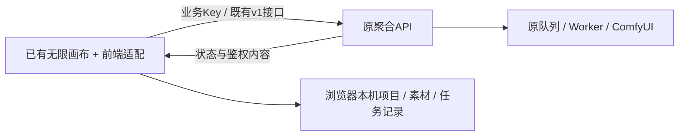

# ComfyUI 创作画布

[English](README.en.md) · [使用与部署](docs/studio/21-独立画布部署与使用.md) · [当前范围与限制](docs/studio/37-交付范围纠正与核心适配现状.md) · [文档索引](docs/studio/README.md) · [更新记录](docs/studio/23-独立画布更新记录.md)

基于 [basketikun/infinite-canvas](https://github.com/basketikun/infinite-canvas) 二次开发的独立 Web 创作画布。复用原有拖拽、缩放、节点、连线和项目管理，适配现有 ComfyUI 聚合 API 的模型、参考输入、异步任务与产物。浏览器直接调用原 API，无须新增生成后端、队列或 GPU 代理。

当前已部署 **154.1**。本轮修复了实时目录中34个usage 1.1模型被旧画布拒绝的问题：45个模型及50组公开规格均通过映射验证，并适配命名图片/视频/音频/GLB输入、专用文本及兼容父任务。真实生图曾受理并排队，随后原任务到期，未产出素材；真实生成验收未通过。详见[本轮实现和验收](docs/studio/38-现有API新版输入适配与整轮验收.md)。

| 画布 | 原业务 API | 管理后台 |
| --- | --- | --- |
| [打开创作画布](http://43.165.167.179:39445/studio/) | `http://43.165.167.179:39443` | [原 Admin](http://43.165.167.179:39443/admin/) |

## 方案与能力


```mermaid
flowchart LR
    W[已有无限画布 + 前端适配] -->|业务Key / 既有v1接口| A[原聚合API]
    A --> G[原队列 / Worker / ComfyUI]
    A -->|状态与鉴权内容| W
    W --> L[浏览器本机项目 / 素材 / 任务记录]
```

| 能力 | 使用逻辑 |
| --- | --- |
| 模型发现 | 读取当前Key的模型说明、Schema、完整preset和参考槽位；不按模型名称猜参数 |
| 生图与参考创作 | 文生图、单图编辑、多参考图按已发布模型适配；画布素材可按声明类型填入旧参考槽或命名素材槽 |
| 视频 | 文生、首帧和多参考按各自Workflow声明调用；不把缺少参考的请求降级为其他模式 |
| 音频与3D | 音频是ComfyUI Workflow产物；支持GLB结果卡、按需预览和原件保存，不把音频默认当TTS |
| 异步任务 | 上传参考 → 显式提交 → 查询原job → 载入/另存；刷新恢复原记录，不盲目新建替代任务 |
| 项目与素材 | 继续使用原画布编辑/项目能力，保留本机保存、ZIP/任务清单和已有引用保护 |
| 青柠与案例 | 全面复用04·青柠；浅色/深色切换持久保存；八个可编辑案例在确认前不会生成 |

所有业务请求使用Bearer Key与`credentials: omit`，不借用Admin会话。画布只调用现有`/v1/`，不修改原转发、调度、Worker、数据库或Admin；管理仍到原后台完成。可选助手、云同步、新格式及容量工程不自动纳入本轮适配。

## 如何使用

1. 打开[连接页](http://43.165.167.179:39445/studio/config)，填写**原API地址**和管理员提供的业务API Key。不要填画布端口、Admin路径或ComfyUI8188。Key默认只在当前页面内存使用，可在可信浏览器选择记住。
2. 查看[模型与用法](http://43.165.167.179:39445/studio/models)，选择当前Key获准的模型和完整规格。尺寸/秒数来自已发布preset，不能任意混搭；模型可见不等于设备空闲或额度充足。
3. 新建/打开画布，或到[案例库](http://43.165.167.179:39445/studio/library)打开可编辑示例。案例可先不带Key浏览，打开不会上传或创建生成任务。
4. 选中图片后点“新建创作”，核对提示词、模型、规格和参考图顺序/角色，明确点击“提交1项生成任务”。视频、音频、GLB也可作为公布的命名输入；按槽位选择素材，不对未声明prompt的模型强加提示词；专用台词/歌词等按文本槽填写，续拍须核对父任务。
5. 在节点/任务页查询原任务，可继续编辑或离开后恢复；取消须等服务端确认。成功后点“载入产物”，鉴权下载校验后回填画布，再播放、继续创作或另存原件。
6. 保存项目，重要内容另存原件或导出含原件的作品ZIP；任务JSON用于原任务核对，不代替作品备份。业务Key权限由原Admin配置。

云端产物通常完成后**八小时到期**，以API元数据为准；已下载本机副本单独保留。项目与素材主要保存在当前浏览器，不是云同步。更换域名、端口或浏览器配置文件时先导出/导入，核对新副本后再处理旧数据。保留当前日志v5，不清空或降级数据库。

具体接口映射、保存/恢复和部署说明见[使用文档](docs/studio/21-独立画布部署与使用.md)；[参考创作说明](docs/studio/35-画布参考创作与生成表单.md)展示输入到结果的流程。

## 命名工作流输入

兼容usage 1.0/1.1。`input_slots`决定素材角色、类型、MIME和大小；图片、视频、音频、GLB按实际槽位选择，上传类型与原幂等键一起保存。`text_slots`显示台词、转写、歌词、曲谱等专用字段，须显式填写。续拍只传原Key可读且成功、兼容、未到期的父任务ID。服务器负责最终媒体校验及准入。[本轮实现与验收状态](docs/studio/38-现有API新版输入适配与整轮验收.md)。

## 页面与演示

| 命名图片输入 · 浅色 | 命名图片输入 · 深色 |
| --- | --- |
|  |  |


[完整页面MP4](docs/studio/media/studio-154/named-inputs.mp4) · 演示使用合成API和素材，不代表GPU生成。


| 浅色 | 深色 |
| --- | --- |
|  |  |

[历史明暗主题与可编辑案例GIF](docs/studio/media/studio-151/themes-and-examples-public.gif)

[完整MP4](docs/studio/media/studio-151/themes-and-examples-public.mp4) · [主题/案例细节、3D与390px对比](docs/studio/36-明暗主题与预设创作案例.md) · [历史真实媒体图集](docs/studio/media/studio-131/README.md)。主题/案例演示使用合成API，不代表GPU生成。历史真实图集记录八类API调用与浏览器取件，当前版本没有重新全量生成；近期双参考视频准备失败原样保留。

## 本地开发与静态部署

在独立`infinite-canvas` Git仓库根目录执行，使用原生Node/npm（已验证Node22.14.0/npm10.9.2）：

```powershell
Set-Location web
npm ci
$env:VITE_BASE='/studio/'
$env:VITE_STUDIO_MODE='managed'
$env:VITE_AGGREGATOR_ORIGIN='http://43.165.167.179:39443'
npm run dev
```

打开`http://localhost:3000/studio/`。生产构建保留这些环境变量，执行`npm run typecheck`和`npm run build`，只部署`web/dist/`。API默认值只含公开地址，不含Key；也可以不设置，让用户自行填写。

`managed`表示使用既有聚合API并禁用上游任意脚本/插件/本地Agent，仍是独立静态部署。用户禁止本地Docker、WSL和虚拟机。沿用高位HTTP端口，域名反代由用户处理；不增加HTTPS门槛，不修改原API任意源CORS。静态更新只切画布目录，保留数据与旧页面资源，不重启原API。详细操作及兼容恢复限制见[部署文档](docs/studio/21-独立画布部署与使用.md)。

## 当前验证与限制

- 本轮279项单元、类型检查和生产构建通过；45个实际模型、50组规格通过契约映射。Chromium明暗各6次命名输入/续拍表单与回填通过，八类旧案例回归通过。Firefox新版命名输入页面通过。四类素材混合及续拍使用明确标注的合成模型，不冒充已上线模型。
- 独立静态154.1的全部124个文件及保留资源、页面路由已核对；原API源代码、指针、配置和服务不改，继续使用高位HTTP端口和现有任意源CORS。
- 本轮真实生图已返回原任务ID，10分钟观察期内持续排队，随后只读复查为expired；没有本轮新GPU产物，也未补发替代生成。后续只读检查确认原任务执行尝试为0；3080有较早的不确定占用且渠道/绑定验证不完整，详见文档38。参考编辑/音频的真实设备验收未签收，历史多参考视频的 `preparation_transport_failure` 仍保留。
- 历史真实图像、视频、Workflow音频和GLB记录可查，但不代表当前45模型全部重新执行。Windows WebKit诊断失败、实际Safari及真机触摸未验，390px仅视口模拟。更多浏览器/编码、原API的10～20台容量不是缺少画布前端功能。


[核心清单及具体问题](docs/studio/37-交付范围纠正与核心适配现状.md) · [当前进度](docs/studio/10-开发进度与交付记录.md) · [历史交付明细](docs/studio/history/10-历史交付与46项评估.md)。后续只处理明确需求与实际缺陷，相关说明同步到授权远端`feat/independent-canvas`；不推上游、不修改main或原API分支。

保留原作者与[MIT许可](LICENSE)。04·青柠参考样式/字体及来源声明随静态包保留。
